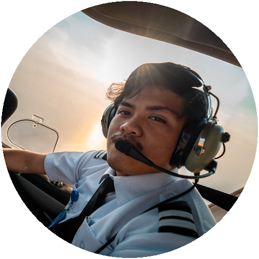
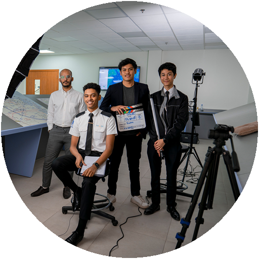

# Hi, I'm Raden 👋

I'm [Raden](https://cv.radenhanifa.com), a pilot, builder, and filmmaker based in Dammam, Saudi Arabia.

I started out in aviation and media, then got into software because I kept finding tools I wished existed. These days I'm usually somewhere between airplanes, cameras, Figma, code, and AI tools.

I'm currently building [RYDAN](https://rydan.radenhanifa.com), an aviation project focused on making preflight and operational workflows simpler.

I have a GACA Private Pilot Licence and Instrument Rating, with more than 300 hours—mostly on the DA40 NG. Since 2022, I've also produced aviation media at OxfordSaudia Flight Academy.

I'm most interested in practical tools based on problems I've actually encountered, especially in aviation and other operational environments. Sometimes the answer is software. Sometimes it's a film, a campaign, or a camera in an airplane.

Outside of work, I'm into aviation, technology, photography, films, and probably more video games than I should be.

#### Let's connect

  
  
  
  

 

  
  &nbsp;&nbsp;&nbsp;&nbsp;
  

